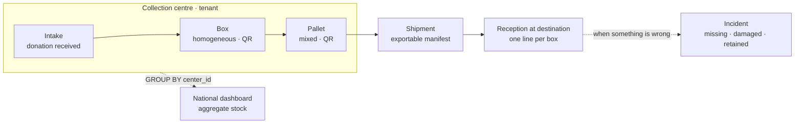
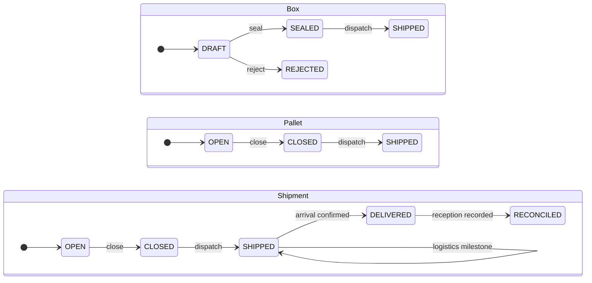

# Araguaney

[](https://github.com/araguaney-lat/araguaney/actions/workflows/backend-tests.yml)
[](https://github.com/araguaney-lat/araguaney/actions/workflows/frontend-tests.yml)
[](https://github.com/araguaney-lat/araguaney/actions/workflows/security-scan.yml)
[](LICENSE)

> **A common standard for coordinating collection centres and humanitarian aid logistics.**
> A free, multi-centre web application: it records **in-kind** donations item by item, packs them
> into **homogeneous boxes** with QR codes, consolidates those into **pallets** and **shipments**
> with an exportable manifest, tracks what actually arrived at the destination, and aggregates
> every centre's stock into a real-time **national dashboard**.
> No beneficiary data, and anonymous donation as the norm: of the donor, only what they choose to
> give is stored, with a declared retention period and automatic purging.

**The flow:** `Intake` → `Box` (homogeneous + QR) → `Pallet` → `Shipment` (with manifest) →
reception at the destination → national aggregate dashboard.

**Public and multilingual:** beyond the operational panel, it serves a **bilingual public site
(ES/EN)** tuned for SEO/AEO — pillars, guides, a glossary, "what is needed" (`/necesidades`),
scenario landings, an FAQ hub and a changelog. Country-agnostic; it works for any emergency
(earthquakes, floods, fires, migration crises).

> Derived from the `fastapi-nextjs-boilerplate`. The product's **what and why**, along with its
> rules, live in [`CLAUDE.md`](CLAUDE.md); the **phase roadmap** in
> [`docs/roadmap/`](docs/roadmap/); SEO/AEO maintenance in
> [`docs/seo-maintenance.md`](docs/seo-maintenance.md).

## Project status

Deployed and publicly reachable at [araguaney.lat](https://www.araguaney.lat). The platform is
built, not a prototype: the operational panel, the public site and the background jobs all run in
production.

| | |
|---|---|
| **Roadmap** | 27 phases · 450 of 477 tasks done (94%) — [`docs/roadmap/`](docs/roadmap/) |
| **Tests** | 883 backend (`pytest`) · 49 frontend (`vitest`) |
| **API contract** | `/v1` accepts additive changes only, enforced against an OpenAPI fingerprint so an old native client cannot be broken by a deploy |
| **Offline capture** | Intake queues locally (IndexedDB) and syncs on reconnect, with an idempotency key minted before the first attempt |
| **Privacy** | No beneficiary data. Donor data is optional, has a declared retention period and purges itself |
| **Observability** | Every cron declares a heartbeat window and alerts naming the promise it broke, not the exception it raised |
| **Licence** | AGPL-3.0 |

## Tech Stack

| Layer | Technology |
|-------|-----------|
| Backend | FastAPI + SQLAlchemy + Alembic |
| Frontend | Next.js 15 + Tailwind CSS |
| Auth | NextAuth v5 (JWT) + bcrypt |
| Database | PostgreSQL |
| Background jobs | ARQ (Redis) — durable queue with in-process fallback |
| Cache | Redis (graceful degradation when absent) |
| Email | Resend + Jinja2 templates |
| Storage | Cloudinary (images) |
| Error tracking | Sentry (backend + frontend) |
| Alerts | Slack Bot (`chat.postMessage`) + infra-status enrichment |
| CI | Dependabot + npm/pip CVE audits (GitHub Actions) |
| Hosting | Railway (backend + DB + Redis) · Vercel (frontend) |
| Edge / SEO | Cloudflare (DNS/WAF) · IndexNow (Bing) · Google/Bing sitemaps |

## Domain model

Multi-tenant "pool / row-level": **one deploy, one database, `center_id` discriminates by
centre** — which is what makes national aggregation a single `GROUP BY`. Every data access goes
through tenant scoping.



Only **sealed** boxes enter a pallet, and only **closed** pallets enter a shipment.

| Entity | Essence |
|---|---|
| `Center` | The tenant (collection centre) |
| `ProductType` | The SKU — category + attributes (e.g. `strength`) |
| `Intake` | Receipt of a donation (donor optional; anonymous by default) |
| `Box` | **Homogeneous** box: 1 `product_type` + 1 batch + 1 expiry · own QR |
| `Pallet` | Pallet (mixed) grouping sealed boxes · own QR |
| `Shipment` | Shipment grouping pallets · produces the manifest / packing list |
| `ShipmentReception` + `ReceptionLine` | What actually arrived, box by box |
| `Incident` | Missing, damaged, retained or a weight difference · `OPEN → RESOLVED` |
| `Campaign` | Campaign/event (public slug at `/eventos/{slug}`) |
| `Transfer` | Inventory transfer between centres |

### State machines

Every transition writes its `*_event` row: `from_status → to_status`, who did it and when.



**Dispatched inventory stays frozen.** `DELIVERED` says it arrived and `RECONCILED` says what
arrived has been recorded, but neither touches a box or a pallet. Sent and received are two
distinct facts and the system keeps both — that separation is what makes shrinkage measurable at
all. Logistics milestones (`shipment_events.milestone`) are events where `from_status =
to_status`: they record that something happened along the way without inventing intermediate
states.

## Roles

- **`users.role`** governs which section you reach: `user` → `/dashboard`, `superadmin` →
  `/studio`, plus the public routes that need no login.
- **`center_role`** controls what each user sees inside `/dashboard`:
  - `volunteer` — intake, boxes, labels (their own centre)
  - `coordinator` — the above plus pallets, shipments, manifests, and managing their centre
  - `national_admin` — national aggregate, centres/campaigns, users, incidents, audit
    (`center_id = NULL`)

## Project Structure

```
.
├── backend/
│   ├── app/
│   │   ├── routers/          # Thin HTTP handlers — validate input, call service, return response
│   │   ├── services/         # Business logic — framework-agnostic, injected with db session
│   │   ├── repositories/     # Data access only — no business logic, named query methods
│   │   ├── models/           # SQLAlchemy ORM models
│   │   ├── schemas/          # Pydantic I/O schemas (strict mode via StrictModel base)
│   │   ├── utils/            # Shared utilities — see "Backend utilities" below
│   │   ├── templates/
│   │   │   └── emails/       # Jinja2 HTML email templates
│   │   ├── config.py         # Pydantic settings — reads from .env
│   │   ├── database.py       # SQLAlchemy engine + session + Base (TCP keepalives)
│   │   ├── dependencies.py   # Auth dependencies (get_current_user, etc.)
│   │   ├── email.py          # Resend send functions
│   │   ├── arq_pool.py       # Durable background-job queue (Redis) + in-process fallback
│   │   ├── worker.py         # ARQ worker: task definitions, crons, fallbacks
│   │   └── main.py           # App factory, lifespan, middleware, versioned routers
│   ├── alembic/              # Database migrations
│   │   └── versions/
│   ├── Dockerfile
│   └── requirements.txt
├── frontend/
│   ├── app/                  # Next.js App Router — [lang]/ (público ES/EN i18n),
│   │                         #   dashboard/, studio/, sitemap.ts, robots.ts, manifest.ts
│   ├── public/               # Static assets + llms.txt / llms-full.txt + IndexNow key
│   └── src/
│       ├── components/       # Shared UI components
│       ├── lib/              # actions.ts, api.ts, routes.ts (i18n), seo.ts,
│       │                     #   structured-data.ts, scenarios.ts, changelog.ts, …
│       ├── content/          # Legal copy (privacy/terms) per language
│       ├── dictionaries/     # i18n (es.json / en.json)
│       └── types/            # Shared TypeScript interfaces
├── .github/
│   ├── dependabot.yml        # Grouped weekly dep updates (npm + pip + actions)
│   └── workflows/
│       └── security-scan.yml # npm/pip audit — blocks only if the PR changes deps
├── docs/
│   ├── roadmap/              # Phase roadmap (source of truth for progress)
│   ├── integrations/         # Portable guides (e.g. Resend deliverability)
│   ├── seo-maintenance.md    # SEO/AEO maintenance runbook
│   └── optional-layers.md    # Optional boilerplate layers
├── docker-compose.yml        # Local dev: db + redis + backend + worker + frontend
└── .env.example              # All env vars documented
```

## Getting Started

### Prerequisites
- Docker + Docker Compose
- Node.js 20+
- Python 3.12+

### Local development with Docker (recommended)

```bash
# 1. Copy and fill env vars
cp .env.example backend/.env
cp .env.example frontend/.env.local
# Edit both files

# 2. Start all services
docker compose up --build

# 3. Run migrations (first time only)
docker compose exec backend alembic upgrade head
```

### Without Docker

**Backend:**
```bash
cd backend
python -m venv .venv && source .venv/bin/activate
pip install -r requirements.txt
cp ../.env.example .env
alembic upgrade head
uvicorn app.main:app --reload
```

**Frontend:**
```bash
cd frontend
npm install
cp ../.env.example .env.local
npm run dev
```

## Environment Variables

See `.env.example` for all variables with descriptions.

### Backend (`backend/.env`)

| Variable | Description |
|----------|-------------|
| `DATABASE_URL` | PostgreSQL connection string |
| `DATABASE_URL_DIRECT` | Direct (non-PgBouncer) URL for Alembic migrations (optional) |
| `SECRET_KEY` | JWT signing secret (`openssl rand -hex 32`, min 32 bytes enforced) |
| `ENCRYPTION_KEY` | Fernet key for `app.utils.crypto` (optional, falls back to `SECRET_KEY`) |
| `REDIS_URL` | Redis for ARQ jobs + cache (optional, degrades gracefully) |
| `FRONTEND_URL` | Frontend URL(s) for CORS — comma-separated |
| `INTERNAL_API_SECRET` | Shared secret for server-to-server endpoints |
| `ADMIN_ALLOWED_IPS` | Comma-separated IPs for admin routes (empty = open) |
| `CLOUDFLARE_ONLY` | `true` to block requests not proxied through Cloudflare |
| `CLOUDFLARE_SHARED_SECRET` | Header secret paired with a Cloudflare Transform Rule (required if `CLOUDFLARE_ONLY`) |
| `GOOGLE_SAFE_BROWSING_API_KEY` | URL reputation checks in `url_security` (optional) |
| `RESEND_API_KEY` | Resend API key for transactional email (optional) |
| `RESEND_WEBHOOK_SECRET` | Svix signing secret for the Resend webhook (email deliverability view) |
| `MAIL_FROM` / `MAIL_FROM_NAME` | Sender address + name for transactional email |
| `INDEXNOW_KEY` | IndexNow token (Bing instant indexing). Must equal `frontend/public/<key>.txt` |
| `SENTRY_DSN` | Sentry DSN — backend error tracking (optional) |
| `SLACK_BOT_TOKEN` | Slack Bot OAuth token `xoxb-...` (optional) |

### Frontend (`frontend/.env.local`)

| Variable | Description |
|----------|-------------|
| `NEXTAUTH_SECRET` | NextAuth signing secret |
| `API_URL` | FastAPI base URL — server-side calls |
| `NEXT_PUBLIC_API_URL` | FastAPI base URL — client-side calls |
| `NEXT_PUBLIC_SITE_URL` | Canonical public host (`https://www.araguaney.lat`) — drives canonicals, sitemap, robots, hreflang |
| `INTERNAL_API_SECRET` | Same value as backend |

## Database Migrations

```bash
# Generate a new migration from model changes
alembic revision --autogenerate -m "add users table"

# Apply all pending migrations
alembic upgrade head

# Rollback one step
alembic downgrade -1
```

## Deployment

| Service | Platform | Notes |
|---------|----------|-------|
| Backend | Railway | Set env vars, run `alembic upgrade head` on release |
| Frontend | Vercel | Connect repo, set env vars in dashboard |
| Database | Railway PostgreSQL addon | Auto-injects `DATABASE_URL` |

## What's included

**Domain (Araguaney)**
- Item-by-item donation intake with validation at receipt (expiry, WHO medicine donation rules,
  controlled substances blocked) — rejection happens at the moment of capture
- **Homogeneous box** guaranteed by the schema (1 product + 1 batch + 1 expiry) with QR + label
- Pallets and shipments with an **exportable manifest / packing list** (PDF/XLSX, queued in ARQ)
- **Weighing at two levels** (box and pallet) and a **goods declaration** with country-agnostic
  field names; HS codes, never a single country's tax regime
- **Extended traceability to the destination** — logistics milestones, arrival, reconciled
  reception box by box, and incidents (missing, damage, customs retention, weight difference)
  with an owner and a resolution
- **Shrinkage as a metric** — the mirror of the intake rejection rate: one measures what was not
  accepted on the way in, the other what did not arrive on the way out
- **Offline capture** — many centres operate in basements with no coverage. Intake is queued on
  the device (catalogue and box codes downloaded while there is signal) and syncs itself when the
  network returns. An idempotency key generated before the first attempt means a retry can never
  duplicate inventory, and nothing is ever discarded silently
- **Donor pre-registration** — donors register online, get a QR, and the centre does a double
  check on receipt; anonymous donation remains the default
- **Risk prevention** — irrevocable-transfer terms, an escalation threshold for atypical volume,
  a customs legend, and a red-flags guide for coordinators
- **National aggregate dashboard** — every centre's stock in real time (one `GROUP BY`)
- **Transfers** between centres · **messaging** between users · campaign **reports**
- **Centre self-registration** with approval (email invitation, forced password change)
- **Email deliverability** — Resend webhook (bounces/complaints) + resend panel
- Reference catalogues (WHO, IFRC/ICRC, IOM, UNSPSC, GS1, RxNorm, COFEPRIS) to classify inventory

**AI-assisted capture (off by default)**
- Free-text donation lines mapped to catalogue products, medicine label OCR, needs-to-stock
  matching, and a written summary of the national aggregate
- **The AI pre-fills, a person confirms.** Nothing is sealed with a value nobody looked at, and no
  capability decides, rejects, assigns or dispatches
- **No public endpoint invokes AI**, enforced in code rather than by convention, plus a monthly
  spend cap, a per-capability flag, caching and rate limiting
- Provider-neutral through an OpenAI-compatible layer: OpenAI, DeepSeek, Groq, Together or a
  local Ollama, all through environment variables
- A **spend panel** in `/studio` showing this month's consumption per capability, the state of
  each switch, and spend per day — because a runaway loop does not show up on the invoice until
  the month is over, and the daily view is what separates usage from a loop

**Observability**
- Every background job that holds a promise alerts when it fails, naming what is left unfulfilled
  rather than which exception was raised
- A cron heartbeat, because a cron that never runs does not fail and therefore never alerts, plus
  `GET /health/jobs` for an external monitor — a watchdog cannot detect its own death
- An alert noise budget that groups by problem identity, so a channel stays worth reading

**Public site & SEO/AEO**
- **Bilingual public site (ES/EN)** with locale by URL (ES unprefixed, EN under `/en/...`,
  translated slugs via `src/lib/routes.ts`) + `hreflang`/canonical
- Pillars, guides, glossary, `/necesidades` ("what is needed"), **scenario** landings
  (`/escenarios/[scenario]`) and **category** landings, `/preguntas-frecuentes` hub, `/novedades`
  changelog, `/nosotros`, and a Mexico landing (COFEPRIS/SAT)
- `sitemap.ts` + `robots.ts` (declares AI crawlers) + `llms.txt` / `llms-full.txt`
- Structured data (schema.org): `Organization` (with `sameAs`/founder), `SoftwareApplication`,
  `Article`/`HowTo`/`FAQPage`/`BreadcrumbList`/`Event`, `speakable` — in `src/lib/structured-data.ts`
- **IndexNow** on publish: creating a public campaign pings Bing from the backend (grounding for
  ChatGPT/Copilot) — see `app/utils/indexnow.py`
- Freshness signals (`dateModified` plus a visible date on guides) and E-E-A-T bylines
- A single canonical host (`www`), with Google Search Console and Bing Webmaster verified
- Recurring maintenance: [`docs/seo-maintenance.md`](docs/seo-maintenance.md)

**Auth**
- JWT auth with token denylist (logout revocation)
- Email + password register with email verification flow
- Password reset flow
- Login lockout after 10 failed attempts (15 min, auto-resets on success)
- OAuth login (Google — wire up in `auth.ts`)
- Role-based access control (`user` / `admin` / `superadmin`)

**Architecture**
- Service / Repository / Schema layer separation (no `db.query()` in routers)
- Pydantic v2 strict mode on all schemas (`StrictModel` / `StrictORMModel`)
- Structured error envelope: `{ error: { code, message, field, meta } }` on every error
- `api_error()` helper for consistent error raising from services

**Security**
- Rate limiting on all sensitive endpoints (slowapi + Cloudflare IP detection)
- Security headers middleware (X-Content-Type-Options, X-Frame-Options, Referrer-Policy)
- `AdminIPAllowlistMiddleware` — restrict admin routes by IP
- `CloudflareOnlyMiddleware` — block direct origin hits in production
- `SECRET_KEY` minimum 32 bytes enforced at startup
- **SSRF protection** for user URLs (`utils/url_security.py`) + optional Google Safe Browsing
- **Input sanitization** helpers for schema validators (`utils/sanitize.py`)
- **Fernet encryption** for sensitive DB-stored values (`utils/crypto.py`)
- **Dependency CVE scanning** in CI (`npm audit` + `pip-audit`) + grouped Dependabot updates

**Background jobs & cache**
- ARQ durable task queue (`arq_pool.py` + `worker.py`) — jobs persist in Redis and
  survive restarts, retry on failure, and run in a separate `worker` container
- **Graceful degradation**: with no `REDIS_URL`, queued tasks fall back to in-process
  FastAPI `BackgroundTasks` and the cache becomes a no-op — zero Redis dependency in dev
- Generic Redis cache helper (`utils/cache.py`) with the same degrade-to-source pattern

**Infrastructure**
- All routes versioned under `/v1` — see [API Versioning](#api-versioning) below
- Sentry error tracking wired on backend and frontend
- Slack Bot alert on unhandled 500 errors, **auto-enriched with Railway/Vercel status**
  (`utils/infra_status.py`) so you instantly know if it's an upstream outage
- GZip compression
- CORS configured for multi-origin (comma-separated `FRONTEND_URL`)
- PgBouncer-compatible connection pooling + TCP keepalives (no dropped idle connections)
- Alembic migrations with autogenerate (uses `DATABASE_URL_DIRECT` to bypass PgBouncer)
- Docker Compose for full local stack (db + redis + backend + worker + frontend)

### Backend utilities (`app/utils/`)

| File | Purpose |
|------|---------|
| `errors.py` | `api_error()` — structured error envelope helper |
| `rate_limit.py` | slowapi limiter instance |
| `cloudflare.py` | `get_client_ip()` — real client IP behind Cloudflare/proxy |
| `slack.py` | `notify_slack()` — fire-and-forget bot alerts |
| `sanitize.py` | `strip_html`, `validate_username/slug/url_scheme` for schema validators |
| `url_security.py` | `validate_url()` (SSRF) + `check_safe_browsing()` for user URLs |
| `crypto.py` | `encrypt_value` / `decrypt_value` (Fernet) for sensitive columns |
| `cache.py` | `get/set/delete/incr` Redis cache, no-op when Redis is absent |
| `infra_status.py` | Railway/Vercel status for Slack alert enrichment |

### Background jobs

Enqueue a durable task from any service — it runs in the `worker` process when
Redis is available, or in-process otherwise:

```python
from app.arq_pool import enqueue

# In a router/service that already has BackgroundTasks injected:
enqueue(background_tasks, "send_verification_email_task", user.email, token)
```

Define the task and its in-process fallback in `app/worker.py`, then run the worker:

```bash
docker compose up worker          # already wired in docker-compose.yml
# or standalone:
cd backend && arq app.worker.WorkerSettings
```

> **Origin:** the background-jobs queue, cache, security utilities, infra-status
> enrichment, TCP keepalives, and CI workflows were ported from the production
> **bioflow** app and generalized for reuse here.

## API Versioning

### Current state

All routes are registered under `/v1` via a `_V1` constant in `main.py`:

```python
_V1 = "/v1"
app.include_router(auth.router, prefix=_V1)
```

This is intentionally the simplest possible starting point — explicit, zero magic, works today.

### Planned: `VersionedRouter` system

The next iteration replaces the raw prefix with a proper versioning infrastructure. Design goals:

- **Multiple version transports** — resolve version from URL path (`/v2/...`), header (`X-API-Version: 2`), or query param (`?v=2`), in that priority order.
- **Version inheritance / fallback** — a v2 router that doesn't define a specific route automatically falls back to the v1 handler. Clients on old versions keep working without changes.
- **Per-handler version ranges** — handlers declare the version range they serve:
  ```python
  @router.get("/users/me", versions=range(1, None))   # all versions
  @router.get("/users/me", versions=range(2, None))   # v2+ only (v1 uses previous handler)
  ```
- **Deprecation response headers** — `X-API-Version`, `Deprecation`, and `Sunset` headers injected automatically for old versions.
- **`VersionRegistry`** — central registry of known versions, their status (`active` / `deprecated` / `sunset`), and sunset dates.
- **No external dependencies** — implemented as ~150 lines of custom FastAPI infrastructure, no cadwyn or fastapi-versioning.

> **Why not cadwyn?** Evaluated and ruled out: background tasks broken in versioned endpoints, OAuth2 broken in Swagger UI, single maintainer, frequent breaking changes from FastAPI/Pydantic updates, and lifespan invoked twice on startup. Overkill for a boilerplate; the custom approach gives 80% of the value with full control.

### Version transport priority

```
1. URL path:   /v2/users/me           → version 2
2. Header:     X-API-Version: 2       → version 2
3. Query:      /users/me?v=2          → version 2
4. Default:    latest stable version
```

### Adding a v2 endpoint (future)

```python
# routers/users.py
@router.get("/users/me", versions=range(1, 2))   # v1 handler
def get_me_v1(current_user = Depends(get_current_user)):
    return UserResponseV1.from_orm(current_user)

@router.get("/users/me", versions=range(2, None))  # v2+ handler (new shape)
def get_me_v2(current_user = Depends(get_current_user)):
    return UserResponseV2.from_orm(current_user)
```

Unversioned routes (Stripe webhooks, health check) bypass the registry entirely.

## Sustainable Development Goals

Araguaney contributes to **SDG 11.5** (significantly reduce losses caused by
disasters) by improving the traceability and efficiency of in-kind humanitarian
logistics, and to **SDG 17.16–17.17** (partnerships for the goals) by giving
independent collection centres a common coordination standard and a shared
aggregate dashboard.

## Licence and trademark

Araguaney's code is **free software under [AGPL-3.0](LICENSE)**: you may use it,
study it, modify it and deploy your own instance. If you run a modified version
as a service, the AGPL requires you to publish your changes.

Using the platform at [araguaney.lat](https://www.araguaney.lat) is **free** for
collection centres and humanitarian coordinators: no licences, no box limits and
no usage fees.

**Ownership.** Araguaney is a project by **Antony Delgado Casanova**, who holds
copyright over the code, the name "Araguaney" and the araguaney.lat domain. No
legal entity is associated with the project.

**The trademark is not licensed with the code.** The name "Araguaney", the logo
and the araguaney.lat domain identify the official instance and its network of
centres. A fork must operate under a different name and domain, without
presenting itself as the official instance — especially during an emergency,
when confusion costs the most.

To report vulnerabilities: [SECURITY.md](SECURITY.md). To contribute:
[CONTRIBUTING.md](CONTRIBUTING.md). Community standards:
[CODE_OF_CONDUCT.md](CODE_OF_CONDUCT.md). Conventions and domain rules:
[CLAUDE.md](CLAUDE.md).

## ¿Prefieres español?

El producto opera en español: la interfaz, los manuales del panel
(`/dashboard/ayuda`), los mensajes de error y los comentarios del código están en
ese idioma. Esta documentación de repositorio está en inglés porque se dirige a
quien evalúa o contribuye al proyecto desde fuera, que es el mismo criterio que
sigue el texto de los pull requests.
