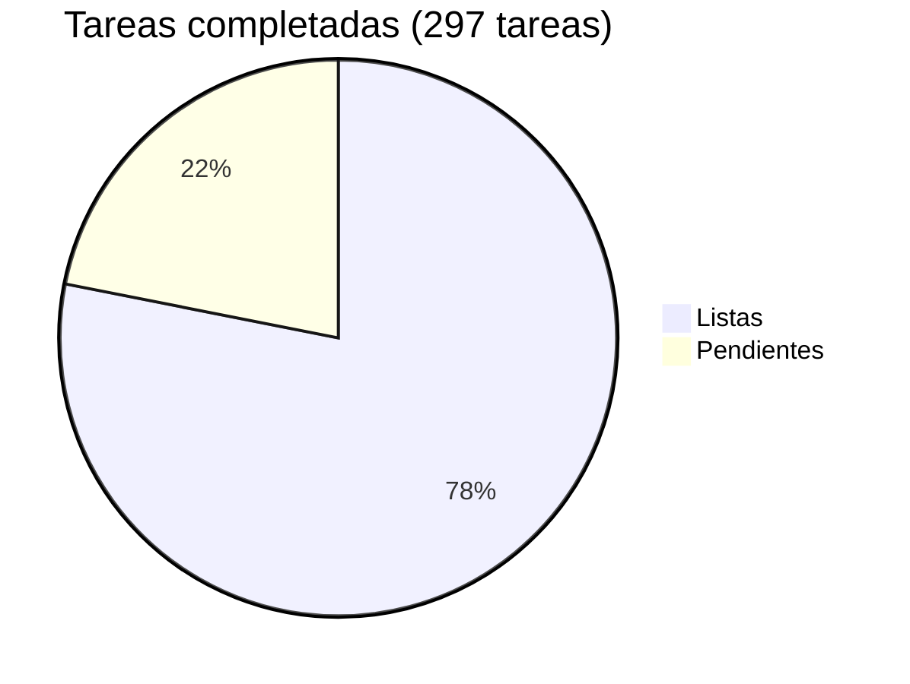

# Acopio — Roadmap

## Progreso general



| Fase | Nombre | Listas | Pendientes | Progreso |
|------|--------|-------:|-----------:|----------|
| 0 | [Scaffolding + multi-tenant + roles](phase-00-scaffolding.md) | 18 | 0 | ✅ 100% |
| 1 | [Catálogo e intake con validaciones](phase-01-catalog-intake.md) | 8 | 0 | ✅ 100% |
| 2 | [Caja homogénea, QR y etiqueta](phase-02-box-qr-label.md) | 6 | 0 | ✅ 100% |
| 3 | [Tarima, envío y manifiesto](phase-03-pallet-shipment-manifest.md) | 9 | 0 | ✅ 100% |
| 4 | [Panel agregado nacional + endurecimiento + OTP + scanning móvil](phase-04-national-dashboard-hardening.md) | 23 | 2 | ✅ 92% |
| 5 | [Studio — panel de administración + solicitudes](phase-05-studio.md) | 39 | 0 | ✅ 100% |
| 6 | [Catálogos de referencia + lookups en tiempo real](phase-06-catalog-integrations.md) | 35 | 0 | ✅ 100% |
| 7 | [Transferencias entre centros](phase-07-transfers.md) | 21 | 0 | ✅ 100% |
| 8 | [Mensajería entre usuarios](phase-08-messaging.md) | 22 | 0 | ✅ 100% |
| 9 | [Reportes de campaña](phase-09-reports.md) | 8 | 0 | ✅ 100% |
| 10 | [Endurecimiento de seguridad (post-auditoría)](phase-10-security-hardening.md) | 22 | 0 | ✅ 100% |
| 11 | [SEO y reposicionamiento genérico](phase-11-seo-positioning.md) | 20 | 3 | 🟡 87% |
| 12 | [Optimización y rendimiento](phase-12-optimization.md) | 0 | 28 | ⬜ 0% |
| 13 | [Compliance y legal](phase-13-compliance-legal.md) | 0 | 18 | ⬜ 0% |
| **Total** | | **232** | **65** | **🟡 78%** |

> Envs opcionales (Sentry, Slack, Google Safe Browsing, Encryption Key) se pueden agregar en cualquier momento sin cambios de código.

---

## Dependencias entre fases

```
Fase 0 ─► Fase 1 ─► Fase 2 ─► Fase 3 ─► Fase 4
                └──────────────► (panel agregado usa datos de 1–3)
                                              │
                                              └──► Fase 5 (Studio)
```

- Fase 4 (endurecimiento + scanning móvil) puede solaparse con 2–3 según prioridad mediática.
- Fase 5 (Studio) depende de Fase 0 (usuarios/roles) pero es independiente de 1–4; puede arrancarse en paralelo.
- Fase 7 (Transferencias) depende de Fases 1–3 (Box/Pallet/Shipment ya deben existir) y de Fase 6 (campaign_id en intakes, scoping de ProductType).
- Fase 8 (Mensajería) depende de Fase 6 (user_campaigns ya debe existir para validar el scope de campaña).

---

## Notas de edición

Cada fase vive en su propio archivo bajo `docs/roadmap/`. Al editar:

- Actualiza el archivo de fase con el cambio de tarea (✅ Done / 🟡 In progress / ⬜ Pendiente).
- Actualiza los totales y el pie chart en este índice al completar o agregar tareas.
- Nuevas fases: archivo `phase-NN-<slug>.md` + fila en la tabla de arriba.
